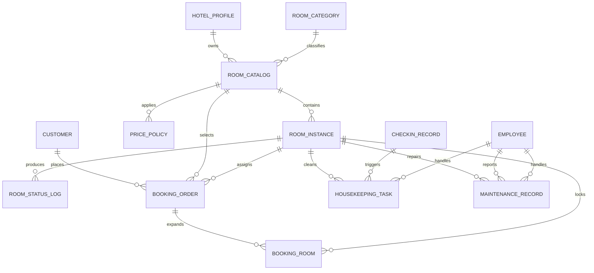

# 成员 A：第 4、5、6 章整理稿（客房资源管理）

本文档对应成员 A 在《酒店管理系统》数据库课程设计中的写作范围，重点覆盖客房资源管理模块，并与当前数据库实现文件 `hotel_management_answer.sql` 保持一致。第四章你已经写过，因此这里保留一个简短承接，正文重点放在第五章和第六章，可直接作为报告草稿继续润色。

---

## 4. 概念结构设计承接说明

第四章已经完成的内容可以概括为：系统围绕酒店基础信息、客房类型、客房目录、实体客房、价格策略、房态日志、预订明细、清扫任务和维修记录等对象建立概念模型，并明确了“酒店 - 客房目录 - 实体客房”这条主业务线。  
在此基础上，第五章需要把这些概念实体转换为逻辑关系模式，并进一步说明主键、外键、第三范式与表间依赖；第六章则对应这些关系模式在 MySQL 中的实际落地，包括建表、完整性约束、触发器、存储过程、视图和演示数据。

---

## 5. 逻辑结构设计

### 5.1 逻辑结构设计

客房资源管理模块的逻辑结构设计，核心目标是把“可展示的客房信息”和“可分配的实际房间资源”分开管理，同时把“当前状态”和“历史状态”分离保存。这样既能支持前台浏览和预订，也能支持后台房态控制、房间清扫、维修处理和报表统计。

结合当前 SQL 实现，客房资源管理模块的核心关系模式如下。

1. `hotel_profile(id, jiudianmingcheng, leibie, xingji, jiudiandizhi, fuwurexian, jiudianjieshao, review_count, avg_score)`  
   用于保存酒店基础信息，是客房目录的归属对象。

2. `room_category(id, room_category)`  
   用于保存客房类型字典，例如标准间、豪华套间等。

3. `room_catalog(id, hotel_profile_id, room_category_id, kefangmingcheng, room_category, kefangjiage, shuliang, jiudianmingcheng, jiudiandizhi, kefangsheshi, kefangjieshao, clicknum, review_count, avg_score)`  
   用于保存可展示、可销售的客房目录信息，是“房型定义层”。

4. `room_instance(id, room_catalog_id, room_no, floor_no, status, created_at, updated_at)`  
   用于保存真实可分配的房间资源，是“实体客房层”。`status` 取值包括 `available`、`reserved`、`occupied`、`cleaning`、`maintenance`。

5. `price_policy(id, room_catalog_id, policy_name, start_date, end_date, price_multiplier, priority, enabled)`  
   用于保存动态价格策略，支持节假日、营销活动、分时段调价。

6. `room_status_log(id, room_id, old_status, new_status, source_type, source_id, operator_id, remark, created_at)`  
   用于保存房态变化历史，满足业务追踪和审计要求。

7. `booking_order(id, customer_id, room_catalog_id, room_instance_id, expected_checkin_date, expected_checkout_date, booking_status, ...)`  
   用于保存预订主单。当前结构已经补充 `customer_id`、`room_catalog_id`、`expected_checkin_date`、`expected_checkout_date` 等字段，能明确关联客户与房型。

8. `booking_room(id, booking_id, room_id, room_price, stay_start_date, stay_end_date, room_status)`  
   用于保存预订与房间的明细关系。该表是当前逻辑结构中的关键优化点，它解决了“一个顾客可下多个订单、一个订单可关联多个房间”的问题。

9. `housekeeping_task(id, room_id, checkin_id, assigned_employee_id, task_type, task_status, scheduled_time, completed_time, remark, created_at, updated_at)`  
   用于保存清扫任务，实现退房待清扫、日常清扫、维修后清扫等场景。

10. `maintenance_record(id, room_id, reported_by_employee_id, handled_by_employee_id, issue_desc, maintenance_status, start_time, end_time, cost_amount, remark)`  
    用于保存客房维修记录，实现报修、处理中、维修完成等状态流转。

从逻辑上看，模块内部形成了三层结构：

1. 酒店与房型基础层：`hotel_profile`、`room_category`
2. 客房定义与资源层：`room_catalog`、`room_instance`、`price_policy`
3. 房态联动与过程层：`room_status_log`、`booking_order`、`booking_room`、`housekeeping_task`、`maintenance_record`

这套 LDM 的优点在于：

1. 同一客房目录可以映射多间实体客房，避免把“房型信息”和“房号信息”混在一张表里。
2. 房态的当前值放在 `room_instance.status`，房态历史放在 `room_status_log`，便于查询和追踪。
3. 价格策略单独建表，避免把不同日期的价格硬编码进客房表。
4. 清扫与维修都通过独立业务表承载，再由触发器联动房态，逻辑更清晰。

---

### 5.2 模式优化

在概念模型向关系模型转换后，本模块重点做了三类模式优化。

#### 5.2.1 目录信息与实体房间分离

如果直接把客房名称、房型、价格、房号、房态等字段全部放进一张表，会造成明显的数据冗余。例如同一种房型下的多间房间会重复保存同样的客房名称、图片、介绍、设施和基础价格。一旦房型基础价格调整，就需要修改多行数据，容易产生更新异常。

因此当前设计将其拆分为：

1. `room_catalog`：描述“卖什么房”
2. `room_instance`：描述“具体哪一间房”

这样可以使客房目录信息只保存一次，实体房间通过外键引用目录主键，从而消除部分函数依赖和更新冗余。

#### 5.2.2 当前状态与历史状态分离

如果只在 `room_instance` 中保存当前状态，那么虽然能知道房间现在是否可用，但无法回答“为什么变成这个状态”“由谁操作”“何时发生变更”等问题。  
因此系统将房态控制拆为两层：

1. `room_instance.status` 保存当前房态
2. `room_status_log` 保存状态变更历史

这种拆分保证了查询效率和审计能力兼顾，也使清扫、维修、入住、退房等业务都可以通过统一日志结构记录状态变化来源。

#### 5.2.3 主单与房间明细分离

原始项目中的预订表偏向“单订单单房间”结构，不利于扩展到一笔订单订多间房。当前新增 `booking_room` 后，实现了：

1. 一个客户可以对应多笔 `booking_order`
2. 一笔 `booking_order` 可以对应多条 `booking_room`
3. 每条 `booking_room` 只绑定一间实体客房

因此，预订业务从简单的一对一关系优化为更合理的一对多关系，更符合真实酒店业务。

#### 5.2.4 第三范式说明

本模块主要关系模式均可认为至少达到第三范式。

| 关系模式 | 关键函数依赖 | 规范化说明 |
| --- | --- | --- |
| `hotel_profile` | `id -> 酒店名称、类别、星级、地址...` | 非主属性完全依赖主键，无传递依赖 |
| `room_category` | `id -> room_category`，`room_category -> id` | 类型字典表，满足 3NF |
| `room_catalog` | `id -> 客房目录描述信息` | 房型描述依赖目录主键，酒店与房型通过外键关联，避免把基础实体信息混入本表 |
| `room_instance` | `id -> room_catalog_id, room_no, floor_no, status...`，`room_no -> id` | 当前房态依赖实体房间主键，无部分依赖 |
| `price_policy` | `id -> room_catalog_id, 起止日期, 价格倍率...` | 价格策略独立存放，避免重复写入客房表 |
| `room_status_log` | `id -> room_id, old_status, new_status, source_type...` | 每条日志唯一表示一次变更，满足 3NF |
| `booking_order` | `id -> customer_id, room_catalog_id, expected_checkin_date...` | 主单负责订单头信息，不再承载多房间明细 |
| `booking_room` | `id -> booking_id, room_id, room_price, stay_start_date...` | 房间明细只依赖本明细主键 |
| `housekeeping_task` | `id -> room_id, task_type, task_status...` | 清扫任务独立管理，消除“房态=清扫中”场景中的附加描述冗余 |
| `maintenance_record` | `id -> room_id, issue_desc, maintenance_status...` | 维修业务独立建表，消除维修描述与房态字段耦合 |

综上，当前模式优化的核心，不是单纯“多建几张表”，而是让每张表只负责一种相对稳定的业务语义：目录负责展示，实例负责资源，日志负责追踪，明细负责关联，任务负责流程。

---

### 5.3 表关系图

下图给出客房资源管理模块优化后的主要外键依赖关系，可作为第五章的 PDM/表关系图说明稿。正式提交时可据此在 PowerDesigner 中绘制更规范的物理模型图。



在正文中可以补充说明以下几条最重要的依赖关系：

1. `room_catalog.hotel_profile_id -> hotel_profile.id`
2. `room_catalog.room_category_id -> room_category.id`
3. `room_instance.room_catalog_id -> room_catalog.id`
4. `price_policy.room_catalog_id -> room_catalog.id`
5. `room_status_log.room_id -> room_instance.id`
6. `booking_order.customer_id -> customer.id`
7. `booking_order.room_catalog_id -> room_catalog.id`
8. `booking_order.room_instance_id -> room_instance.id`
9. `booking_room.booking_id -> booking_order.id`
10. `booking_room.room_id -> room_instance.id`
11. `housekeeping_task.room_id -> room_instance.id`
12. `maintenance_record.room_id -> room_instance.id`

---

## 6. 表结构与数据库实现

### 6.1 表结构数据字典描述

以下数据字典以客房资源管理模块为中心，选取了最关键的 10 张表。写报告时可以把这一节作为“结构说明 + 完整性约束说明”的主体内容。

| 表名 | 主键 | 主要字段 | 外键/约束 | 业务说明 |
| --- | --- | --- | --- | --- |
| `hotel_profile` | `id` | `jiudianmingcheng`、`leibie`、`xingji`、`jiudiandizhi` | 主键约束 | 保存酒店基础信息 |
| `room_category` | `id` | `room_category` | `room_category` 唯一 | 保存客房类型字典 |
| `room_catalog` | `id` | `kefangmingcheng`、`kefangjiage`、`shuliang`、`kefangsheshi`、`kefangjieshao` | `hotel_profile_id`、`room_category_id` 外键 | 保存客房目录与展示信息 |
| `room_instance` | `id` | `room_no`、`floor_no`、`status` | `room_catalog_id` 外键；`room_no` 唯一 | 保存可分配的实体房间 |
| `price_policy` | `id` | `policy_name`、`start_date`、`end_date`、`price_multiplier`、`priority` | `room_catalog_id` 外键 | 保存价格策略 |
| `room_status_log` | `id` | `old_status`、`new_status`、`source_type`、`source_id`、`remark` | `room_id` 外键 | 保存房态变更历史 |
| `booking_order` | `id` | `customer_id`、`room_catalog_id`、`expected_checkin_date`、`expected_checkout_date`、`booking_status` | `customer_id`、`room_catalog_id`、`room_instance_id` 外键 | 保存预订主单 |
| `booking_room` | `id` | `booking_id`、`room_id`、`room_price`、`room_status` | `(booking_id, room_id)` 唯一；双外键 | 保存订单与房间的明细绑定 |
| `housekeeping_task` | `id` | `task_type`、`task_status`、`scheduled_time`、`completed_time` | `room_id`、`checkin_id`、`assigned_employee_id` 外键 | 保存清扫任务 |
| `maintenance_record` | `id` | `issue_desc`、`maintenance_status`、`start_time`、`end_time`、`cost_amount` | `room_id`、`reported_by_employee_id`、`handled_by_employee_id` 外键 | 保存维修记录 |

#### 6.1.1 实体完整性

1. 上述核心表均以 `id` 作为主键。
2. `room_category.room_category` 设置唯一约束，保证同名房型不重复。
3. `room_instance.room_no` 设置唯一约束，保证房号唯一。
4. `booking_room(booking_id, room_id)` 设置联合唯一约束，防止同一订单重复锁定同一房间。

#### 6.1.2 参照完整性

1. `room_catalog` 必须依赖合法的酒店和客房类型。
2. `room_instance` 必须依赖合法的客房目录。
3. `price_policy` 必须依赖合法的客房目录。
4. `room_status_log`、`booking_room`、`housekeeping_task`、`maintenance_record` 都必须依赖合法的实体房间。
5. `booking_order` 必须通过外键关联客户、客房目录和已分配房间。

#### 6.1.3 复杂完整性

复杂业务约束主要通过触发器和存储过程实现：

1. 预订明细写入后，自动锁定实体房间。
2. 入住记录写入后，自动把房间改为 `occupied`。
3. 退房后，自动把房间改为 `cleaning`，并生成清扫任务。
4. 维修报修后，自动把房间改为 `maintenance`。
5. 维修完成后，自动把房间改为 `cleaning`，并补建清扫任务。
6. 清扫完成后，自动把房间改回 `available`。

因此，本模块的数据完整性并不是只靠主键和外键完成，而是“主键 + 外键 + 唯一约束 + 触发器 + 存储过程”共同实现。

---

### 6.2 表的创建

本模块的完整建表 SQL、外键约束、触发器、存储过程和演示数据，已统一写入：

- `hotel_management_answer.sql`：完整答案版，包含建表、约束、视图、存储过程、触发器和演示数据
- `hotel_management_todo.sql`：去除视图、存储过程、触发器后的待完成版

就客房资源管理模块而言，第六章可重点说明以下实现要点。

#### 6.2.1 建表实现要点

1. `room_catalog` 与 `room_instance` 分表创建，体现“客房目录”和“实体客房”的分层设计。
2. `booking_order` 与 `booking_room` 组合实现“一个顾客多订单、一订单多房间”。
3. `housekeeping_task` 与 `maintenance_record` 补充了原项目未落地的清扫、维修流程。
4. `employee_performance` 虽然属于员工考核，但与清扫、维修、入住、结账统计直接相关，因此在后续报表中会被引用。

#### 6.2.2 数据完整性实现要点

本模块直接依赖的核心触发器包括：

1. `trg_booking_after_insert_lock_room`
2. `trg_booking_room_after_insert_lock_room`
3. `trg_checkin_after_insert_room_occupied`
4. `trg_checkin_after_update_room_available`
5. `trg_housekeeping_after_update_release_room`
6. `trg_maintenance_after_insert_mark_room`
7. `trg_maintenance_after_update_release_room`

这些触发器保证了“预订 - 入住 - 退房 - 清扫 - 维修”整条链路中的房态自动联动。

#### 6.2.3 存储过程实现要点

与成员 A 模块最密切相关的存储过程包括：

1. `sp_search_available_rooms`：按日期、房型、价格区间查询可预订客房
2. `sp_create_booking_order`：生成预订订单并分配房间
3. `sp_batch_update_room_status`：批量更新房态
4. `sp_create_housekeeping_task`：创建清扫任务
5. `sp_report_room_maintenance`：提交客房维修记录
6. `sp_generate_employee_assessment`：生成员工考核结果

其中，本次整理时已经修正了 `sp_create_booking_order` 在多房间分配场景下与触发器联动产生的表更新冲突问题：过程内部先将待分配房间写入临时表，再写入 `booking_order` 和 `booking_room`，从而避免 `booking_room` 插入语句直接读取 `room_instance` 时与触发器同时更新该表造成冲突。

#### 6.2.4 演示数据补充说明

为了支持后续截图和答辩演示，当前 `hotel_management_answer.sql` 在脚本末尾补充了演示数据，导入后可直接得到以下业务状态：

1. 一条完整的预订 - 入住 - 退房 - 结账 - 支付流程
2. 一条正在入住中的流程
3. 一条待清扫任务
4. 一条维修处理中记录
5. 两条员工考核结果

因此，导入脚本后可以在视图中直接观察到：

1. `reserved`、`occupied`、`cleaning`、`maintenance` 四类典型房态
2. 非空的入住视图、账单视图、营收视图、员工考核视图
3. 便于截图演示的真实关联数据

---

### 6.3 子模式（视图）的设计

本项目的视图设计不再按成员分工拆开叙述，而是直接按照整个酒店管理系统的管理需求来组织。其核心目标是把多表联结、统计汇总和业务过程数据整理为便于管理员查询、前端报表展示和课程设计答辩演示的子模式。所有视图的创建脚本均已写入 `hotel_management_answer.sql`，导入数据库后可直接执行查询。

#### 6.3.1 全项目视图清单

| 视图名 | 作用 | 主要来源表 |
| --- | --- | --- |
| `v_room_inventory_overview` | 按客房目录汇总总房间数、空闲数、预订数、在住数、清扫数、维修数 | `room_catalog`、`room_instance` |
| `v_room_daily_status` | 展示每间实体客房当前状态、关联订单、入住、清扫、维修信息 | `room_instance`、`booking_room`、`booking_order`、`checkin_record`、`housekeeping_task`、`maintenance_record` |
| `v_booking_detail` | 展示预订订单与顾客、房型、房间明细的综合结果 | `booking_order`、`customer`、`room_catalog`、`booking_room`、`room_instance` |
| `v_checkin_guest_detail` | 展示入住记录、入住人信息、办理员工和房间信息 | `checkin_record`、`checkin_guest`、`employee`、`room_instance`、`room_catalog` |
| `v_bill_payment_summary` | 展示账单、支付记录、应收实收和支付状态 | `bill`、`payment_record`、`checkin_record`、`booking_order` |
| `v_monthly_revenue_report` | 按月份统计订单收入、账单收入和实收金额 | `booking_order`、`bill`、`payment_record` |
| `v_employee_operation_summary` | 汇总员工在入住、清扫、维修、账务等流程中的业务量 | `employee`、`checkin_record`、`housekeeping_task`、`maintenance_record`、`bill`、`payment_record`、`operation_log` |
| `v_customer_value_profile` | 统计顾客订单数、入住次数、消费金额与客户活跃情况 | `customer`、`booking_order`、`checkin_record`、`bill`、`payment_record` |
| `v_housekeeping_task_detail` | 展示清扫任务状态、房号、房型和执行员工信息 | `housekeeping_task`、`room_instance`、`room_catalog`、`employee` |
| `v_employee_performance_detail` | 展示员工考核周期、各项业务指标、总分与等级 | `employee_performance`、`employee` |

从管理用途上看，这 10 个视图可以归为三类：

1. 房态与资源视图：`v_room_inventory_overview`、`v_room_daily_status`、`v_housekeeping_task_detail`
2. 业务过程视图：`v_booking_detail`、`v_checkin_guest_detail`、`v_bill_payment_summary`
3. 报表分析视图：`v_monthly_revenue_report`、`v_employee_operation_summary`、`v_customer_value_profile`、`v_employee_performance_detail`

#### 6.3.2 视图 SQL 脚本说明

在 `hotel_management_answer.sql` 中，各视图均采用 `CREATE VIEW ... AS SELECT ...` 的方式定义。设计时遵循以下原则：

1. 明细视图尽量保留业务主键和关键编号，便于继续联查。
2. 汇总视图直接输出统计字段，减少前端重复计算。
3. 视图命名统一以 `v_` 开头，便于在 Navicat 和 MySQL 中集中管理。
4. 与房态、考核、报表相关的复杂逻辑尽量在数据库层一次整理好，再交给前端图表直接消费。

如果在报告中需要写“创建视图的 SQL 脚本”，可直接引用 `hotel_management_answer.sql` 中这 10 段 `CREATE VIEW` 语句作为正文或附录内容。

#### 6.3.3 具体演示实例

本节可直接作为“具体演示实例”撰写内容。截图时建议在 Navicat 或 MySQL 中执行以下查询。

1. 客房库存与房态总览

```sql
SELECT * FROM v_room_inventory_overview;
SELECT * FROM v_room_daily_status;
```

预期效果：可以看到不同房型的库存分布，以及房间当前处于 `available`、`reserved`、`occupied`、`cleaning`、`maintenance` 等状态的明细。

2. 预订与入住流程演示

```sql
SELECT * FROM v_booking_detail;
SELECT * FROM v_checkin_guest_detail;
```

预期效果：可以看到预订订单与顾客、房型、房号之间的关联结果，并能够展示至少一条已入住记录和对应入住人信息。

3. 财务结算演示

```sql
SELECT * FROM v_bill_payment_summary;
SELECT * FROM v_monthly_revenue_report;
```

预期效果：可以看到账单应收、实收、支付状态，以及按月份汇总后的营收结果，适合用于管理员财务报表截图。

4. 员工业务与考核演示

```sql
SELECT * FROM v_employee_operation_summary;
SELECT * FROM v_employee_performance_detail;
```

预期效果：可以看到员工参与入住、清扫、维修、账务等业务的工作量统计，以及员工考核周期、总分、等级等结果。

5. 顾客价值演示

```sql
SELECT * FROM v_customer_value_profile;
```

预期效果：可以看到顾客订单数、入住次数和消费金额，适合作为会员价值或客户运营分析的展示样例。

#### 6.3.4 视图截图文件

当前数据库已补充演示数据，并已为全部视图生成截图文件，统一保存在 `docs/assets/view_screenshots/` 目录下：

1. `v_room_inventory_overview.png`
2. `v_room_daily_status.png`
3. `v_booking_detail.png`
4. `v_checkin_guest_detail.png`
5. `v_bill_payment_summary.png`
6. `v_monthly_revenue_report.png`
7. `v_employee_operation_summary.png`
8. `v_customer_value_profile.png`
9. `v_housekeeping_task_detail.png`
10. `v_employee_performance_detail.png`

如果正文篇幅有限，建议优先放以下几张：

1. `v_room_inventory_overview.png`：体现客房资源管理
2. `v_room_daily_status.png`：体现房态流转
3. `v_monthly_revenue_report.png`：体现财务报表
4. `v_employee_performance_detail.png`：体现员工考核

其余截图可放在附录中，作为“系统视图完整展示”。

---

## 结论与写作建议

如果把这一部分压缩成报告结论，可以概括为：

1. 本模块采用“客房目录 + 实体房间 + 房态日志 + 预订明细 + 清扫任务 + 维修记录”的分层设计。
2. 经模式优化后，核心关系模式均达到第三范式，减少了数据冗余和更新异常。
3. 通过外键、唯一约束、触发器和存储过程，系统实现了预订、入住、退房、清扫、维修之间的房态联动。
4. 通过 `v_room_inventory_overview`、`v_room_daily_status`、`v_housekeeping_task_detail` 等视图，可以直接支持客房资源管理、报表展示和课程设计答辩演示。

如果你后面还要把这份文稿继续压成“正式论文口吻”，建议下一步只做三件事：

1. 把“我/我们”的表述全部改成客观叙述。
2. 给图 6-1、图 6-2、图 6-3 加正式图号和图注。
3. 在参考 `PowerDesigner` 图之后，把 5.3 的 Mermaid 图改写成与最终 PDM 完全一致的文字说明。
